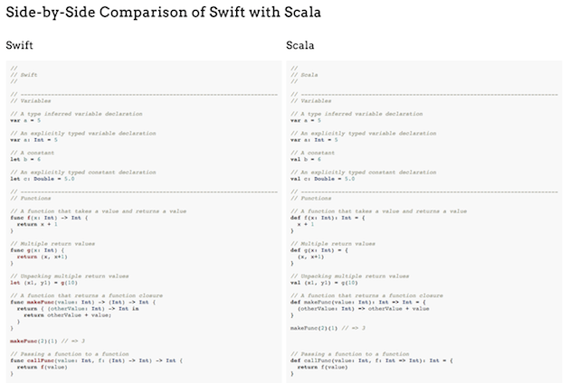

[Swift](https://developer.apple.com/swift/) is a modern multi-paradigm
programming language that shares some convenient features already available in
other current generation languages. My personal feeling is that
[Scala](http://www.scala-lang.org/) has had a heavy influence on its design. In
this post I want to explore the similarities and differences to see how true
this may be.

I was lucky enough to attend [Daniel Steinberg's](http://dimsumthinking.com/)
excellent [Swift Tutorial at NSScotland
2014](http://nsscotland.com/tutorial.html). It was very good and covered the
basics thoroughly. I would recommend attending one if he is teaching near you.

I felt immediately at home with Swift. Almost every language feature introduced
felt familiar because it felt and often looked just like equivalent features in
Scala. Superficially, it seemed like Swift was basically some good bits of
Scala brought to a compile-to-native language for Mac/iOS.

This is of course a bit subjective. Unsurprisingly, while talking to fellow
tutorial attendees in the breaks everyone had similar feelings but cited
different languages. I heard people say Google’s Go, JavaScript or C# were most
similar to them.

My nerdy curiosity was sufficiently piqued that I felt I wanted to compare some
syntax side-by-side. So I did (if anything to prevent anyone else having to
carry out this geeky activity), enjoy, you’re welcome. So far only Scala is
compared, but a Go comparison is under development and I think C# is worth a
look too.

So, other than the obvious difference that Scala runs on the JVM and Swift
compiles to native code, how do they compare? Click the image below to access
the side-by-side comparison:

[Side-by-Side Comparison of Swift to Scala](http://cultivatehq.github.io/swift-design-influences)

Similarities:

* Static typing with type inference.
* Similar variable/constant
  declaration syntax, with the type annotation occurring after the variable name.
* No need for semi-colons to terminate statements.
* Function declarations are
  structurally similar — with the return type being stated after the parameters -
  but differ in exact syntax.
* First-class / higher-order functions, closures
  and a block syntax.
* Functions are able to return multiple values.
* Functions
  can have named, default and variadic parameters.
* Both borrow the sensible
  idea that overriding methods in subclasses must be done explicitly using the
  `override` keyword.
* “For-each” style `for` loop for iterating over sequences.
* Ranges for easy definition of sequences.
* Both support functional sequence
  enumeration using `map`, `reduce`, `filter`. However Swift stops short of
  implementing `flatMap`, `foldRight`, `foldLeft` and so on.
* Safe `case`
  statements with no implicit fallthrough
* Both feature pattern matching using
  switch/case style control flow, although Scala’s goes a bit deeper.
* Both use
  the monadic Optional pattern to deal more explicitly with the possibility of
  non-existent values. In particular both use it for the return value of lookups
  in dictionary/map types.
* Tuples.
* Generics.
* Operator overloading with
  custom infix and prefix operators.
* Attributes/annotations on types and
  declarations.
* Both support enumeration types.
* Both can be run like scripting languages, both have REPLs, yet both compile
  if required.

Differences:

* Their class definition syntax is quite different.
* In addition to pass-by-reference `class` types, Swift has a pass-by-value
  `struct` type like C/C++/C#. Scala only has the former.
* Swift supports external parameter names for functions, which differ from the
  parameter names inside the function.
* Scala includes a sequence comprehension syntax.
* Scala has implicit returns, Swift doesn’t. Shame.
* Scala supports lazy evaluation
* Swift uses “extensions” to add additional behaviour to existing classes,
  whereas Scala uses Traits and mixins.

Neither of the above are exhaustive, but I hope the points worth noting are
included. So it looks like there are a lot of common features, sometimes with
no more than syntactic differences. So what do you think, is Scala the major
influence I feel it is?
